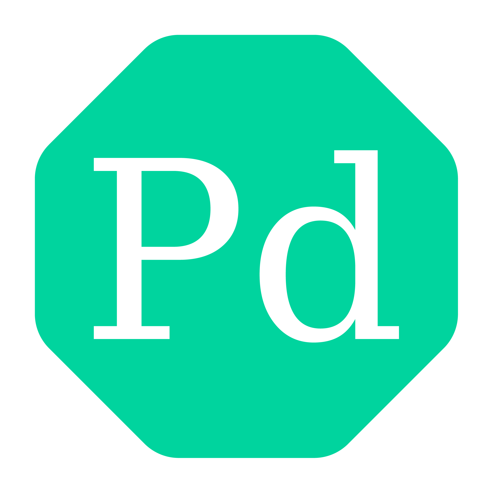

<div align="center">

</div>

**Pallad** is a high-level hybrid programming language inspired by scientific clarity and elemental precision. It blends the simplicity of scripting languages with powerful control and advanced features.

> [!Important]  
> Pallad is currently in the design and concept stage with very first implementation. See the License and Markdown files for more information.

## Introduction

### Design
Pallad is designed to be a principled and versatile language that makes programming easier while remaining scientifically grounded. With the rise of AI-assisted coding, Pallad aims to simplify code generation, review, and modification. It is highly adaptable, capable of compiling into multiple languages, and allows for easy implementation of custom features.

### Philosophy
Pallad follows the philosophy of **clarity and control**. Everything is simple by default, but when you switch to manual mode, full control is entirely yours.  
This makes Pallad suitable both for learning programming and for building complex systems.

### Comparison
Pallad learns from other languages to improve itself, while maintaining a unified environment where all features are consistent and aligned with its core vision. As a high-level language, it offers simple syntax and manages many operations by default.

## Name
The name **Pallad** is derived from the element *Palladium* (symbol **Pd**, atomic number 46).  
It reflects the vision of a language that is **elemental, precise, and globally resonant**—a foundation as strong and valuable as the metal itself. You may see Pd instead of Pallad in this repo, docs, etc.

## Inspiration
Pallad is inspired by Python, GDScript, C++, Java, and others. It attempts to overcome their limitations by combining their strengths. At the same time, it remains a standalone language with unique features and structures rarely seen elsewhere, most of which focus on enhanced code control—a major advantage for a scripting language.

## Features

### Implementation
Pallad is built on **Rust**. Provides a step-by-step code running:
```text
-> Tokenize
   -> Parse
      -> Compile
         -> Run
```
+Each code is passed to the lexer, which converts the code's text to a list of tokens (tokenize). Then, tokens are passed to the parser to generate statements and create an AST, which is used by the compiler to transform to a bytecode-like stack (program). The program is passed to the VM for execution in order (in Rust).

### Syntax
Pallad uses English keywords (often abbreviated) and standard symbols from other languages. Its syntax is similar to Python and GDScript: keywords and declarations define expressions, and indentation separates code blocks.

### Special Features
> [!Note]  
> For more details on special features, see the example files and syntax guide.

Pallad offers unique features focused on simplicity and programmer quality of life (common features from Python and others are omitted here):
- Built-in docstring formatter  
- Keywords for navigation and code organization  
- Expression validation wherever possible  
- Dynamic typing by default  
- Optional setters & getters for variables  
- Rich, dynamic, and composite data types:  
  - States  
  - Sets  
  - Pairs  
  - Triplets  
  - Char  
  - Multi-dimensional arrays  
  - Tables  
  - Queues  
  - Callable  
  - Color  
- Full optional support for static typing  
- Simple public & private access modifiers  
- Variable argument functions  
- Named parameters  
- Lambda functions  
- Signals  
- Powerful enums:  
  - Anonymous enums  
  - Anonymous shadow  
  - Named enums  
  - Enums as types  
- `switch` / `case` / `default`  
- Advanced loops with monitoring  
- Bitwise operations  
- `in` / `not in`  
- `try` / `except` / `else` / `finally`  
- `raise` / `assert`  
- Internal logging  
- Simple I/O  
- `with` environment manager  
- Internal file management  
- Object-oriented programming  
- `class` / `extends`  
- `import` / `exclude`  
- Static variables and functions  
- Static constructors  
- Constructors with overloading  
- `static` blocks  
- Inner classes  

## Install
Pallad is not yet implemented and currently has no public interpreter or compiler.

## Examples

### Hello World
```pallad
print("Hello World!")
```

### Constructor Overloading
```pallad
class User

var name: string
var age: int

constructor(): # Simple constructor
    self.name = "Unknown"
    self.age = 0

constructor(name: string): # Constructor with parameter
    self.name = name
    self.age = 0

constructor(name: string, age: int): # Overloading
    self.name = name
    self.age = age

constructor(copy: User): # Copy constructor
    self.name = copy.name
    self.age = copy.age
```

### Advanced Loop Monitoring
```pallad
for i in range(1, 10):
    for j in range(1, 10) as inner_status: # optional advanced loop monitoring
        if i == j:
            break(2) # breaks two loops
        if i == 9 and j == 9:
            continue(2) # skips this iteration and the next one
        if i == 10:
            continue(loops=2) # skips this iteration and the current iteration in outer loop
    match inner_status.status:
        case LOOP_STATUS_COMPLETE:
            print("Inner loop completed successfully.")
        case LOOP_STATUS_FULL_SKIP:
            print("Inner loop was never executed.")
        case LOOP_STATUS_HAS_SKIP:
            print(f"Inner loop was skipped {inner_status.skip_count} times.")
        case LOOP_STATUS_BREAK:
            print(f"Inner loop broke at iteration {inner_status.break_iteration}.")
    print(f"Inner loop executed: {inner_status.iter_executed} of {inner_status.iter_count} ({inner_status.iter_completely_executed} iterations completed)")
else:
    print("Nothing")
```

## Documentation
- [Syntax Guide](spec/syntax.md)
- [Examples](examples/)

## Project Status
This project is currently in first development stage.

### Current Features
This is a list of currently implemented features.
- Keywords:
  - `var`
- Types:
  - `int`
  - `float`
- Operators:
  - `+` - `int`, `float`
  - `-` - `int`, `float`
  - `*` - `int`, `float`
  - `/` - `int`, `float`
  - `//` - `int`, `float`
  - `%` - `int`, `float`
- Built-in functions:
  - `print`

### Known Issues
This is a list of known missing points about implemented features listed above:
- `var` keyword without initial value rise parse error `Expected '=', got EOL` (`parser.rs:55-70`)

### Future Improvements
- **Design:**  
  - Decide whether Pallad will be a compiler, interpreter, or both  
  - Plan for async functionality 
  - New types:
    - Date / Time / Duration
    - Struct / Record
  - Mixed types behavior
  - Plan for pattern matching
  - Macro / Metaprogramming
  - Reflection / Introspection
  - Multi-threading / Parallel execution
  - Foreign Function Interface
- **Core:**  
  - Choose the primary implementation language  
  - Implement interpreter/compiler
  - Transpile feature
- **Standard Library:**
  - date/time
  - networking
  - math
  - file system utilities
  - regex/pattern matching
  - serialization
- **Tooling & Ecosystem:**
  - Package Manager
  - Formatter/Linter
  - Debugger
  - REPL
  - LSP Server
- **Community & Documentation:**
  - Tutorials & Examples
  - Syntax highlighter
  - Test suite
  - Discussion/Ideas

## Contribution
Since Pallad is currently just a concept without even an experimental interpreter or compiler, contributions are more valuable in improving the concept rather than implementation. Contributions can be made via PRs and issues.

## License
```text
Pallad Proprietary Draft License
Copyright © 2025 Mahan Khalili

1. Ownership
All rights related to the design, innovations, syntax, and features described in this project
are the intellectual property of the Pallad project. No part of this project or its
innovations may be used, modified, or redistributed without written permission from the owner.

2. Usage Restrictions
- Use of this project and its innovations is permitted exclusively within the Pallad project.
- Any use in other projects, whether commercial or non-commercial, is strictly prohibited
  until the official release of Pallad stable version 2.0.
- Reverse engineering, copying, or reproducing parts of this project outside Pallad
  constitutes a violation of this license.

3. Distribution
- Redistribution of this project or any part of it without written permission from the owner
  is prohibited.
- Public release is only permitted in the official Pallad project form.

4. Liability
This project and its innovations are provided "as is." The owner assumes no responsibility
for errors, defects, or damages resulting from unauthorized use.

5. Term
This license remains valid until the official release of Pallad stable version 2.0.
After the release of version 2.0, new licensing terms may replace this license.

6. Governing Law
This license is governed by international intellectual property and copyright laws,
as well as the local laws of the owner’s jurisdiction.
```