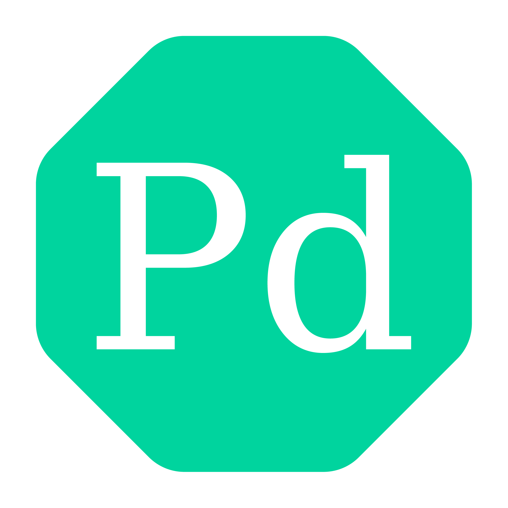

<div align="center">

</div>

**Pallad** is a high-level hybrid programming language inspired by scientific clarity and elemental precision. It blends the simplicity of scripting languages with powerful control and advanced features.

> [!Important]
> Pallad is currently in the design and concept stage with very first implementation. See [Project Status](#project-status) section below for more information.

## Introduction

### Design
Pallad is a principled, versatile language that simplifies programming while staying scientifically grounded. With AI-assisted coding on the rise, Pallad streamlines code generation, review, and modification. It’s highly adaptable, able to compile into multiple languages, and supports easy integration of custom features.

### Philosophy
Pallad follows the philosophy of **clarity and control**. Everything is simple by default, but when you switch to manual mode, full control is entirely yours. This makes Pallad suitable both for learning programming and for building complex systems.

### Name
The name **Pallad** is derived from the element *Palladium* (symbol **Pd**, atomic number 46). It reflects the vision of a language that is **elemental, precise, and globally resonant**—a foundation as strong and valuable as the metal itself. You may see Pd instead of Pallad in this repo, docs, etc.

### Inspiration
Pallad is inspired by Python, GDScript, C++, Java, JavaScript, and others. It attempts to overcome their limitations by combining their strengths. At the same time, it remains a standalone language with unique features and structures rarely seen elsewhere, most of which focus on enhanced code control—a major advantage for a scripting language.

### Comparison
Pallad learns from other languages to improve itself, while maintaining a unified environment where all features are consistent and aligned with its core vision. As a high-level language, it offers simple syntax and manages many operations by default.

## Features

### Implementation
Pallad is built on **Rust**. Provides a step-by-step code running:
```text
Tokenize -> Parse -> Compile -> Run
```
Code is passed to the lexer, which converts the text to a list of tokens (tokenize). Then, tokens are passed to the parser to generate statements and create an AST, which is used by the compiler to transform to a bytecode-like stack (program). The program is passed to the VM for execution in order (in Rust).

### Syntax
Pallad uses English keywords (often abbreviated) and standard symbols from other languages. Its syntax is similar to Python.

### Special Features
> [!Note]
> For more details on features, see the [examples](examples/) and [specifications](spec/).

Pallad offers some unique features:
- Transpiling to other languages besides the interpreter
- Dynamic typing by default, strong static typing when needed
- Optional setters & getters for variables
- Rich and dynamic data types
- Simple public & private access modifiers
- Variadic params for functions
- Named parameters
- Signals
- Powerful enums
- Powerful branching with `match`
- Advanced loops with monitoring
- Internal logging
- Simple I/O
- `with` environment manager
- Internal file management
- Object-oriented programming as first-class paradigm
- Static constructors
- Overloading

## Project Status
This project is currently in its first development stage.

- Single-line comments with `#`
- Multi-line comments with `"""`
- Variable declaration and change
- Types:
    - `none`
    - `bool`: `true` / `false`
    - `int`
    - `float`
    - `string`: single-line (`"`) and multi-line (`"""`)
- `+`, `-`, `*`, `**`, `/`, `//`, `%`, `and`, `or`, `not` operators
- Built-in functions: `print`

You can see a complete list of features with implementation status in [features document](spec/features.md). Use GitHub issue tracker to see more information for each item.

Please see [list of known issues](spec/features.md#known-issues) for possible problems in current features.

## Install
Pallad is not yet released as any tagged version, so you need to compile it from source to use it. You need Rust (with Cargo) and a clone of the git repository. When you run `cargo run` in the repository root, binaries will be generated in the `target/` directory. You can use `pallad "path/to/code.pd"` to run your Pallad code.

## Examples

### Hello World
```pallad
print("Hello World!")
```

### Constructor Overloading
```pallad
class User

var name: string
var age: int

constructor(): # Simple constructor
    self.name = "Unknown"
    self.age = 0

constructor(name: string): # Constructor with parameter
    self.name = name
    self.age = 0

constructor(name: string, age: int): # Overloading
    self.name = name
    self.age = age

constructor(copy: User): # Copy constructor
    self.name = copy.name
    self.age = copy.age
```

### Advanced Loop Monitoring
```pallad
for i in range(1, 10):
    for j in range(1, 10) as inner_status: # optional advanced loop monitoring
        if i == j:
            break(2) # breaks two loops
        if i == 9 and j == 9:
            continue(2) # skips this iteration and the next one
        if i == 10:
            continue(loops=2) # skips this iteration and the current iteration in outer loop
    match inner_status.status:
        LOOP_STATUS_COMPLETE:
            print("Inner loop completed successfully.")
        LOOP_STATUS_FULL_SKIP:
            print("Inner loop was never executed.")
        LOOP_STATUS_HAS_SKIP:
            print(f"Inner loop was skipped {inner_status.skip_count} times.")
        LOOP_STATUS_BREAK:
            print(f"Inner loop broke at iteration {inner_status.break_iteration}.")
    print(f"Inner loop executed: {inner_status.iter_executed} of {inner_status.iter_count} ({inner_status.iter_completely_executed} iterations completed)")
else:
    print("Nothing")
```

## Documentation
- [Syntax Guide](spec/syntax.md)
- [Examples](examples/)

## Contribution
Pallad is in early development. Contributions of all kinds—whether refining the language concept, improving the implementation, writing tests, or opening issues—are welcome. Please open PRs and issues to contribute.

## License
```text
Copyright 2026 Mahan Khalili

   Licensed under the Apache License, Version 2.0 (the "License");
   you may not use this file except in compliance with the License.
   You may obtain a copy of the License at

       http://www.apache.org/licenses/LICENSE-2.0

   Unless required by applicable law or agreed to in writing, software
   distributed under the License is distributed on an "AS IS" BASIS,
   WITHOUT WARRANTIES OR CONDITIONS OF ANY KIND, either express or implied.
   See the License for the specific language governing permissions and
   limitations under the License.
```

See [LICENSE](/LICENSE) file for more information.
